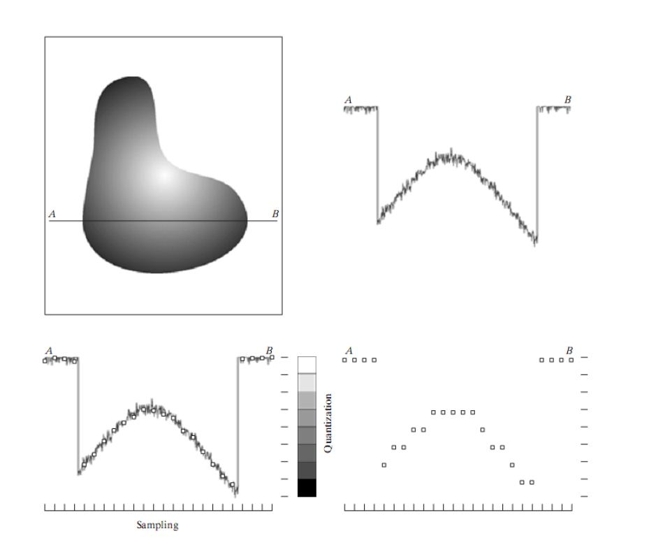

# Quantization and Sampling 

# Introduction 
  
<!--    -->

 
Two critical steps are involved in dealing with analog signals and transforming continuous signals from the real world into digital form: <b>sampling and quantization </b> . Through these procedures, we are able to represent continuous data in a format that digital systems, like computers, can analyze and store for further analysis or transfer. This blog will go into great length on these ideas, outlining their significance, modes of operation, and distinctions.

# 1) Sampling: (Transforming Discrete-Time Signals from Continuous-Time Signals)
   The process of transforming a continuous-time signal into a discrete-time signal is called sampling. When working with continuous signals (such light, sound, or any other analog signal found in the real world) with digital systems like computers or digital storage devices, this step is crucial. The basic idea is to transform the signal from a continuous form to a set of discrete values that can be processed digitally by taking periodic measurements (samples) of the signal's amplitude over time.

# 1.1) Continuous vs. Discrete Signals

<h3> 1.1.1) Continuous Signals: </h3>
A signal type that is specified at all times is called a continuous signal. These signals span a continuous domain (time, space, etc.) and have a continuous range of values. A continuous signal can be mathematically represented as a function with a value at each instant in time.   
 <h2> x(t),t∈(−∞,∞) </h2>
 <h3>Time Variable (t): </h3> There are no interruptions or gaps in the signal's value as it changes over time. It is always going to yield a certain value and may be measured at any time.
<h3>Amplitude: </h3> Any real number within a predetermined range can be used to represent the amplitude of a continuous signal.

Electromagnetic Waves: Light and radio waves are continuous signals that fluctuate at every instant of time.
Analog Signals: Old telephones or vinyl records transmit and store information as continuous signals, representing data in a continuous range.

<h3> 1.1.2) Discrete Signals: </h3>
A signal that is only specified at particular, discrete times is called a discrete signal. Discrete signals only take values at certain times in time, leaving ambiguous gaps in between, in contrast to continuous signals, which have values for every time point.
<h2>x[n],n∈Z</h2>
<h3>Index Variable (n): </h3>Discrete signals are commonly indexed using integers 𝑛n, where 𝑛 = 0…, 1‒, 2†, 3…, …n=0,1,2,3,…. Each index denotes a discrete point in time. Only at these integer values is the value of the signal defined or known.
<h3>Amplitude: </h3> Although the signal is only sampled at discrete intervals, the amplitude at each discrete time point can nevertheless take any real quantity.
Stock Market Prices: Prices of stocks can be considered discrete signals because they are typically observed and recorded at specific time intervals, such as every minute or every second.
Pulse Sequences: In digital electronics, binary pulse sequences (like 0s and 1s in digital circuits) are examples of discrete-time signals.

# 1.2 How Does Sampling Work?
Imagine a smooth sine wave that varies constantly over time to represent an audio stream. We measure this wave throughout the sampling procedure at regular intervals, or what are referred to as sample points. The number of times we collect these measurements in a second is indicated by the sampling rate. A sampling rate of 1,000 Hz (or 1 kHz), for example, is achieved if we sample the sine wave 1,000 times per second. This implies that we are able to digitally mimic the original continuous signal since we are capturing the wave's amplitude at 1,000 different locations per second. More detail in the audio stream might be captured with a greater sampling rate, giving a more accurate depiction of the sine wave.

# 1.3 The Nyquist-Shannon Sampling Theorem

A key idea in signal processing, the Nyquist-Shannon Theorem guarantees the precise reconstruction of a continuous signal from its discrete samples. It stipulates that the sampling rate, or Nyquist rate, must be at least twice the highest frequency in the signal. For example, a signal must be sampled at least 40 kHz if it comprises frequencies up to 20 kHz. A phenomenon known as aliasing, in which higher frequencies pose as lower ones, happens if the sampling rate drops below this threshold. This causes distortion and information loss in the reconstructed signal. In order to preserve the accuracy of digital representations of analog signals, this approach is essential.

# 1.4 Types of Sampling
By measuring a signal at regular intervals, uniform sampling maintains a constant sample rate across the course of the measurement. This is a simple and commonly used approach for applications where proper signal representation requires keeping a constant sample frequency, such as in audio and video processing.

Non-uniform sampling, on the other hand, happens when there is variation in the time intervals between samples. This might be advantageous in situations when the features of the signal change with time. For example, non-uniform sampling can optimize data gathering and reduce redundancy by permitting broader intervals during less dynamic periods while capturing variations more densely during periods when a signal varies more quickly.

# 1.5 Importance of Sampling in Real Life
In many domains, sampling is essential for converting analog signals into digital representations. Live sound is sampled in digital audio to produce digital recordings that can be played back on computers and cellphones. In order to produce pixel data for image processing and produce crisp digital pictures, digital cameras sample light intensities across an image sensor. Radar systems also use sampling to record continuous radar signals, which allows for object tracking and detection through the analysis of reflected waves. These uses demonstrate how versatile sampling is for processing and altering real-world data in a variety of contexts.

# 2. Quantization: (Converting Continuous Amplitudes into Discrete Amplitudes)
Quantization is the process of transforming the continuous range of amplitudes of a signal into a limited number of discrete values. While sampling focuses on capturing the signal at specific time intervals, quantization addresses the signal's amplitude by mapping each sampled value to the nearest discrete level. This step is essential in digital signal processing, as it allows continuous signals to be represented in a digital format, making them suitable for storage and analysis in computing systems.

# 2.1 How Does Quantization Work?
A signal's continuous amplitude range is split into a limited number of discrete levels, or steps, when it is quantized. An amplitude that ranges from 0 to 1, for example, may be broken down into 256 discrete steps, each of which represents a fixed value or range of values. This procedure is carried out by an analog-to-digital converter (ADC), which first samples the signal before mapping the sampled values to these discrete levels. These levels are commonly represented as binary integers, such as 8-bit or 16-bit. The continuous stream may now be digitally processed and stored thanks to this conversion.
# 2.2 Quantization Error
The discrepancy between the real continuous signal and the quantized signal, which occurs when the signal's amplitude is not precisely aligned with a discrete quantization level, is known as the quantization error or quantization noise. More degrees of finer quantization lower this error but need more bits to store the data, resulting in a more accurate signal representation. On the other hand, coarse quantization, which uses fewer levels and more bits, is more effective in terms of storage but comes at the expense of precision. It also has a larger possibility for mistake.
# 2.3 Types of Quantization
To provide a consistent representation across the range, uniform quantization divides the signal into equal-sized intervals and maps all of the signal amplitudes uniformly to the available quantization levels. Uneven intervals are used in non-uniform quantization, which frequently results in more accurate quantization of smaller amplitudes than larger ones. Since it is in line with human hearing sensitivity, this strategy is especially helpful for audio transmissions. It is used in techniques like μ-law or A-law companding, which maximize the representation of softer sounds while preserving overall signal fidelity.

# 2.4 Quantization Bit Depth
The quantization process is directly impacted by the bit depth, which establishes the number of discrete levels into which a signal is split. Finer quantization is made possible by more bits, which results in a more accurate representation of the amplitude of the signal. Eight-bit quantization, for instance, delivers 256 discrete levels, but sixteen-bit quantization yields 65,536 levels. In high-fidelity applications like professional audio recording, higher bit depths—such as 16-bit or 24-bit—are frequently employed to capture greater dynamic range and information in the sound.

# 2.5 Quantization in Real Life
Quantization is used in:

When sound is transformed into discrete amplitude levels for digital device playback, quantization is crucial to achieving accurate sound reproduction. As seen in formats like JPEG, quantization in image compression shrinks picture file sizes by mapping pixel values to fewer levels. Similar to this, quantization in video processing optimizes storage and bandwidth while preserving acceptable visual quality by compressing video data by modifying pixel intensity and color values.

# 3. Comparison of Sampling and Quantization
Quantization focuses on transforming the signal's amplitude into discrete levels, whereas sampling transforms an analog signal into a discrete-time signal by recording its values at regular intervals. When combined, they allow an analog signal to be fully converted into a digital format, although they each focus on a distinct area: amplitude for quantization and time for sampling.

# 4. Practical Examples of Sampling and Quantization
# 4.1 Digital Audio Recording
A microphone records the analog audio signal as a continuous waveform throughout songwriting. In order to construct a discrete-time signal, this signal is then sampled at a high rate, such as 44.1 kHz, which means the waveform is measured 44,100 times per second. Following sampling, the amplitude of each sampled point is converted into discrete levels to quantize the data. Professional audio recording frequently uses a 16-bit or 24-bit depth, which offers excellent dynamic range and precision and guarantees that the audio will not lose quality when converted to a digital format for editing or playback.

# 4.2 Image Processing
The image sensor of a digital camera samples the light intensity from a scene using millions of small components known as pixels. Every pixel captures the color and intensity of the light at a particular location. The intensity of the color is then quantized into discrete numbers, usually with an 8-bit depth for the RGB (red, green, and blue) color channels. This implies that 256 distinct intensity levels may be represented by each channel, making a total of nearly 16 million colors possible. This procedure guarantees precise color representation throughout digital processing and storage of the acquired image.

Conclusion
Both sampling and quantization are essential in converting continuous analog signals into a digital form that computers can process. While sampling determines the time intervals for capturing signal information, quantization decides how finely the signal's amplitude is represented. Together, these processes allow for effective storage, transmission, and reconstruction of signals in digital systems.
